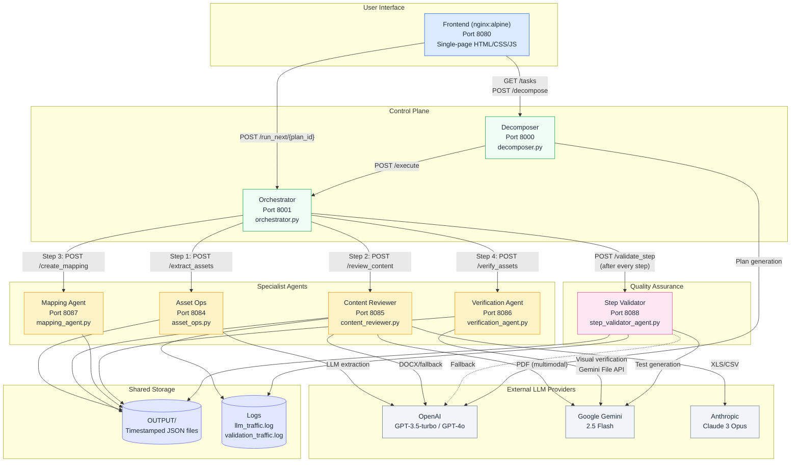
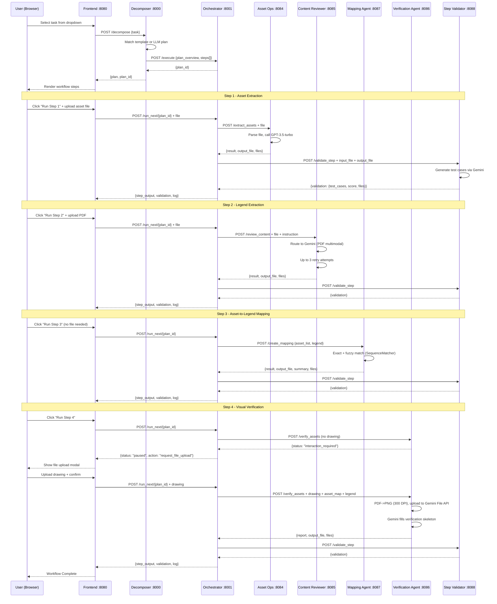
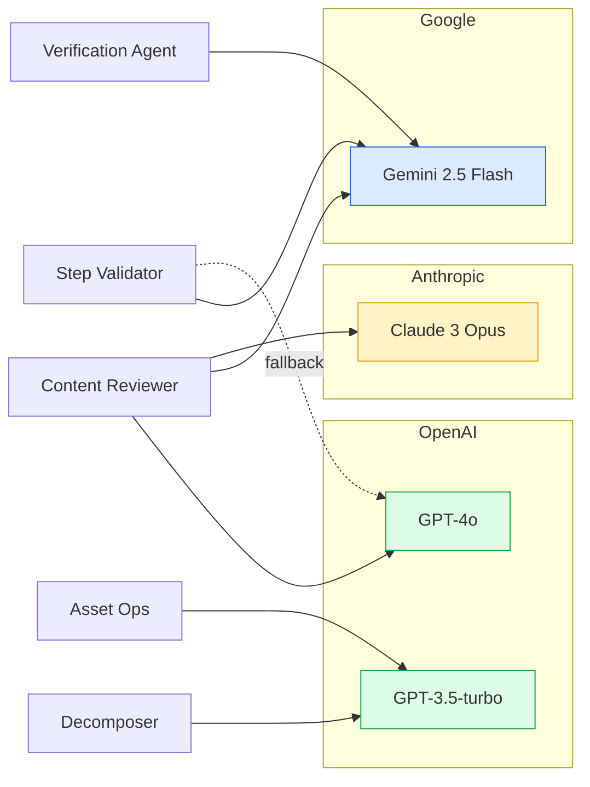
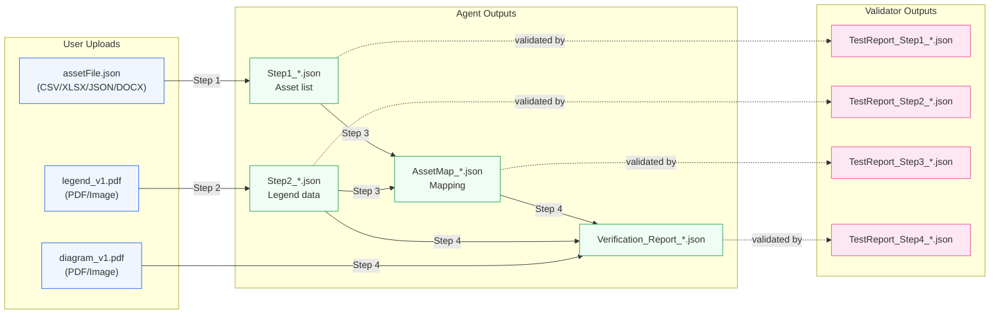
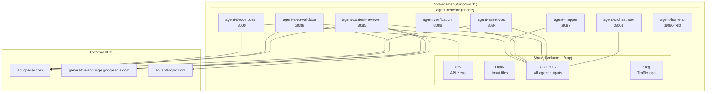

# Agent 03 - Architecture Design Document

## System Overview

A multi-agent workflow system for automated infrastructure asset verification.
Eight Docker-containerised microservices communicate over a shared bridge network,
orchestrated by a central step executor with independent QA validation.

---

## Architecture Diagram



---

## Data Flow Diagram



---

## Service Inventory

| Service | Port | File | Framework | Role |
|---------|------|------|-----------|------|
| Frontend | 8080 | index.html | nginx + vanilla JS | User interface |
| Decomposer | 8000 | decomposer.py | FastAPI | Task planning & template matching |
| Orchestrator | 8001 | orchestrator.py | FastAPI | Step execution, routing, state management |
| Asset Ops | 8084 | asset_ops.py | FastAPI | Data extraction from CSV/XLSX/JSON/DOCX |
| Content Reviewer | 8085 | content_reviewer.py | FastAPI | Legend extraction with multi-LLM routing |
| Verification Agent | 8086 | verification_agent.py | FastAPI | Visual drawing cross-reference |
| Mapping Agent | 8087 | mapping_agent.py | FastAPI | Asset-to-legend fuzzy join |
| Step Validator | 8088 | step_validator_agent.py | FastAPI | Independent QA test case generation |

---

## Common Elements Across All Agents

### 1. Framework Pattern
Every agent follows the same structural pattern:
```python
from fastapi import FastAPI
from dotenv import load_dotenv

load_dotenv()
app = FastAPI(title="Agent Name")

# Endpoint(s)
@app.post("/action")
async def action(...):
    # 1. Parse input
    # 2. Process (LLM call or logic)
    # 3. Save output to OUTPUT/
    # 4. Return {status, result, output_file, files}

if __name__ == "__main__":
    import uvicorn
    uvicorn.run(app, host="0.0.0.0", port=XXXX)
```

### 2. Output File Convention
All agents write timestamped JSON to a shared `OUTPUT/` directory:
```
OUTPUT/{StepType}_{YYYYMMDD_HHMMSS}.json
```
| Agent | File Pattern |
|-------|-------------|
| Asset Ops | `Step1_*.json` |
| Content Reviewer | `Step2_*.json` |
| Mapping Agent | `AssetMap_*.json` |
| Verification Agent | `Verification_Report_*.json` |
| Step Validator | `TestReport_*.json` |

### 3. Response Envelope
All agents return a standard response structure:
```json
{
    "status": "success",
    "result": { ... },
    "output_file": "OUTPUT/StepN_20260215_123456.json",
    "files": {
        "files_read": [
            {"filename": "...", "role": "input", "description": "..."}
        ],
        "files_output": [
            {"filename": "...", "path": "...", "role": "output", "description": "..."}
        ]
    }
}
```

### 4. LLM Integration Patterns
| Pattern | Used By |
|---------|---------|
| Single provider (OpenAI) | Decomposer, Asset Ops |
| Multi-provider dispatch (file-type routing) | Content Reviewer |
| Primary + fallback (Gemini -> OpenAI) | Step Validator |
| Gemini File API (visual/multimodal) | Verification Agent, Content Reviewer (PDF) |
| Retry with self-correction | Content Reviewer (up to 3 attempts) |

### 5. Docker Pattern
All Python services use the same Dockerfile structure:
```dockerfile
FROM python:3.9-slim
WORKDIR /app
COPY requirements_xxx.txt .
RUN pip install -r requirements_xxx.txt
COPY agent_file.py .
CMD ["uvicorn", "agent_file:app", "--host", "0.0.0.0", "--port", "XXXX"]
```

### 6. Networking
- All containers on `agent-network` (Docker bridge)
- Inter-service calls use container DNS names: `http://service-name:port`
- Frontend calls use `localhost:port` (browser -> host -> container)

### 7. State Management
The Orchestrator maintains in-memory state per execution:
```python
executions[plan_id] = {
    "plan": ExecutionRequest,
    "current_step_index": 0,
    "total_steps": N,
    "is_complete": False,
    "results": {
        "asset_list": {},    # From Step 1
        "legend": {},        # From Step 2
        "asset_map": {},     # From Step 3
        "verification_report": {},  # From Step 4
        "validations": []    # From Step Validator
    }
}
```

### 8. Validation Pipeline
After every specialist agent completes, the Orchestrator automatically:
1. Captures input data, output data, and file references
2. Reads the agent's output file from shared disk
3. Forwards everything to the Step Validator via multipart POST
4. Step Validator generates structured test cases (TC-001, TC-002, ...)
5. Test results are stored in state and returned to the frontend

---

## LLM Provider Usage Map



---

## File I/O Flow



---

## Infrastructure Diagram


