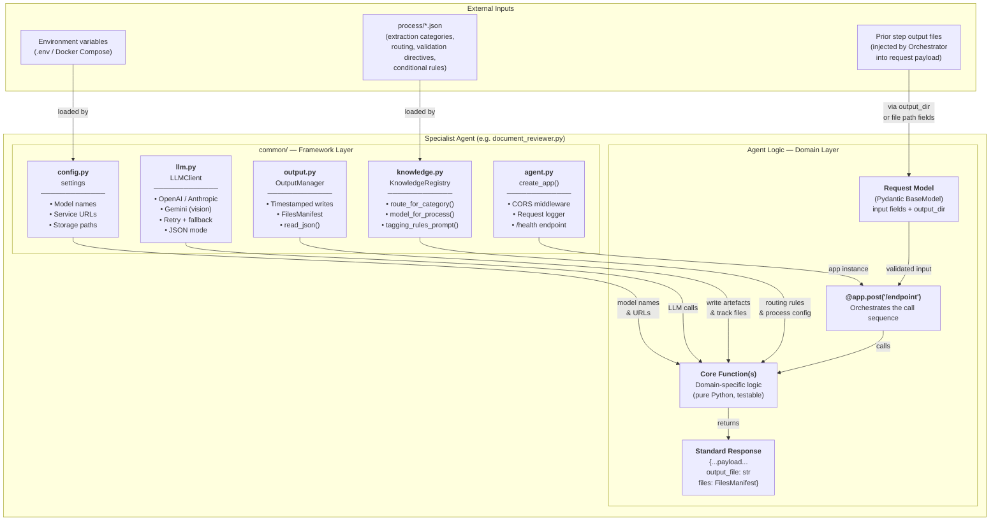
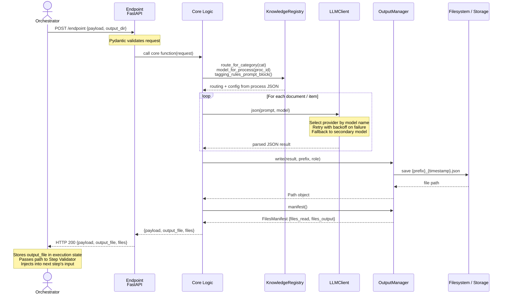
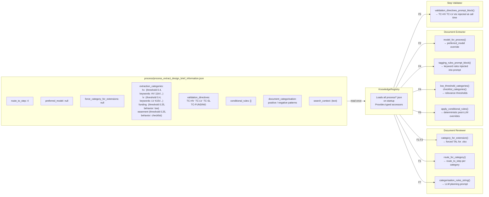
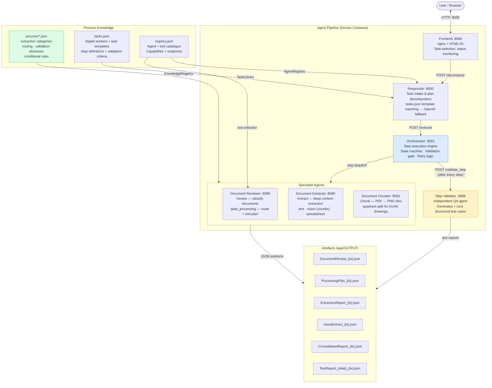
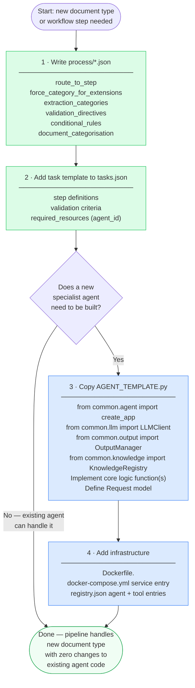

# Standard Agent Design — Diagrams

---

## 1. Standard Agent Internal Structure

Every specialist agent is assembled from the same five building blocks. Domain logic is the only part that varies between agents.



---

## 2. Request Lifecycle Through a Standard Agent



---

## 3. Process-Driven Configuration Flow

Showing how a single process JSON file drives behaviour across three different agents — eliminating hardcoded domain logic from each.



---

## 4. Agent Pipeline — System Context



---

## 5. Standard Agent — Anatomy at a Glance

```
┌─────────────────────────────────────────────────────────────────────────────┐
│                         SPECIALIST AGENT                                    │
│                                                                             │
│  ┌──────────────────────────────────────────────────────────────────────┐  │
│  │  FRAMEWORK LAYER  (common/)  — identical in every agent             │  │
│  │                                                                      │  │
│  │  create_app(title, model)   settings          LLMClient             │  │
│  │  ├─ CORS middleware         ├─ LLM model names ├─ OpenAI (json mode) │  │
│  │  ├─ Request logger          ├─ Service URLs    ├─ Anthropic          │  │
│  │  └─ GET /health             └─ Storage dirs    ├─ Gemini (vision)    │  │
│  │                                                └─ Retry + fallback   │  │
│  │  OutputManager              KnowledgeRegistry                        │  │
│  │  ├─ write(data, prefix)     ├─ route_for_category()                 │  │
│  │  ├─ register_read()         ├─ model_for_process()                  │  │
│  │  └─ manifest() → files{}   ├─ tagging_rules_prompt_block()          │  │
│  │                             └─ apply_conditional_rules()             │  │
│  └──────────────────────────────────────────────────────────────────────┘  │
│                                                                             │
│  ┌──────────────────────────────────────────────────────────────────────┐  │
│  │  DOMAIN LAYER  — unique per agent                                   │  │
│  │                                                                      │  │
│  │  Request Model               Core Logic Functions                    │  │
│  │  ├─ input fields             ├─ call LLM with process-driven prompt  │  │
│  │  ├─ output_dir (optional)    ├─ read/parse documents                 │  │
│  │  └─ job_id (optional)        └─ apply conditional rules              │  │
│  │                                                                      │  │
│  │  Endpoint  POST /my-endpoint                                        │  │
│  │  ├─ validate request (Pydantic)                                      │  │
│  │  ├─ initialise OutputManager(job_dir)                               │  │
│  │  ├─ call core function(s)                                           │  │
│  │  ├─ out.write(result, prefix)                                        │  │
│  │  └─ return {**result, output_file, files: manifest()}               │  │
│  └──────────────────────────────────────────────────────────────────────┘  │
│                                                                             │
│  Standard Response Contract (required by Orchestrator)                      │
│  ├─ output_file : str        path to primary JSON artefact                 │
│  └─ files       : dict       {files_read: [...], files_output: [...]}      │
│                                                                             │
└─────────────────────────────────────────────────────────────────────────────┘

  External inputs injected by Orchestrator into every request:
  ├─ output_dir   →  OutputManager(job_dir=output_dir)  isolates per execution
  ├─ job_id       →  correlation ID for logging
  └─ *_file paths →  paths to prior step artefacts (step1_output_file etc.)
```

---

## 6. New Agent Checklist


